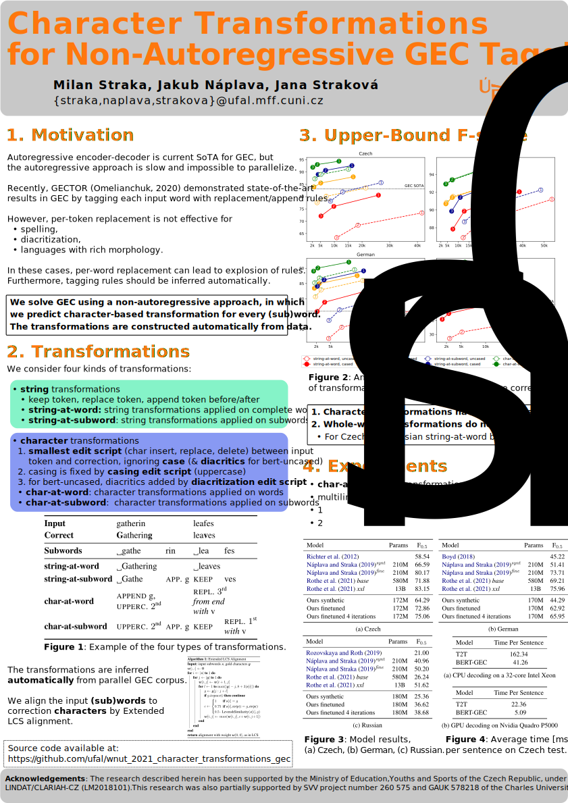

<h1 align="center"><b>Character Transformations for Non-Autoregressive GEC Tagging</b></h1>

<p align="center"><i><b>Milan Straka, Jakub Náplava, Jana Straková</b></i></p>

<p align="center"><i>Charles University<br>Faculty of Mathematics and Physics<br>Institute of Formal and Applied Linguistics</i></p>

<p align="center"><a href="https://aclanthology.org/2021.wnut-1.46/"><b>Paper</b></a></p>

---

This repository contains supplementary source code of the
_Character Transformations for Non-Autoregressive GEC Tagging_ paper.
Consider it a research prototype, not an off-the-shelf product.

## Structure

The repository contains two main components:

- [`rules`](rules) directory contains the scripts for generating
  transformations from aligned GEC data, encoding gold data using
  transformations and applying the transformations on input data;

- [`training`](training) directory contains the scripts for training
  a BERT-like model on gold data encoded with transformations.

## Poster



## Citation

```
@inproceedings{straka-etal-2021-character,
    title = "Character Transformations for Non-Autoregressive {GEC} Tagging",
    author = "Straka, Milan and N{\'a}plava, Jakub and Strakov{\'a}, Jana",
    booktitle = "Proceedings of the Seventh Workshop on Noisy User-generated Text (W-NUT 2021)",
    month = nov,
    year = "2021",
    address = "Online",
    publisher = "Association for Computational Linguistics",
    url = "https://aclanthology.org/2021.wnut-1.46",
    pages = "417--422",
}
```
